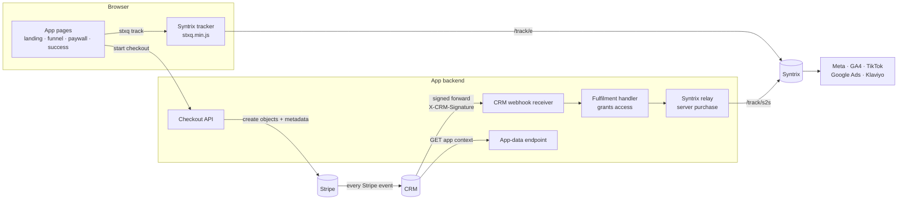

# 1. Overview

Every app connects to the same three systems. Everything else is the app's
own choice.

| Same in every app | Different per app |
| --- | --- |
| **Stripe**: takes payments | Framework, backend, database |
| **Syntrix**: ad-conversion tracking (our "pixel"), forwards conversions to Meta, GA4, TikTok, Google Ads, Klaviyo | URLs and page layout |
| **The CRM**: every product is connected to it. It owns the Stripe webhook, shows customers and orders, and calls the app for context | Funnel (quiz / onboarding), plans, prices, markets |

## How the pieces fit

Follow one purchase through it:

1. The visitor lands. The tracker loads and Syntrix records the ad click,
   UTMs and visits by itself.
2. The app fires a few **events** at fixed moments: funnel steps, email
   given, prices shown.
3. Checkout creates Stripe objects, each carrying the **eight metadata
   keys**.
4. Stripe sends events to the **CRM**. The CRM forwards each one, signed, to
   the app's webhook receiver.
5. The app's **fulfilment handler** grants access. This is the only place
   access is ever granted. It also sends the **server purchase** to Syntrix.
6. The success page fires the **browser purchase**. Syntrix keeps the first
   copy of the two and forwards it to the ad platforms.
7. When support opens the customer in the CRM, the CRM calls the app's
   **App-data endpoint** to show live app context.

## Page roles

Each app maps these roles to its own URLs.

| Role | What it is | Tracker? |
| --- | --- | --- |
| Landing page | Where ads and organic links point | Yes |
| Funnel | Quiz, questionnaire or onboarding before the paywall | Only if its URLs are neutral |
| Paywall | Shows plans and prices after the funnel | Yes, once prices show |
| Offer page | A landing page with checkout built in, no funnel first | Yes |
| Success page | Shown after payment | Yes |
| Recovery landing | Where an abandoned-checkout link lands | Yes |
| Legal pages | Terms, privacy | Yes |
| Logged-in app | The product itself | **Never** |

### Neutral vs revealing URLs

A URL is **neutral** if it says nothing about why the visitor is there:
`/start/step-3`.

It is **revealing** if any part names a topic, condition, goal, symptom,
answer or product category: `/quiz/<condition>/<question>`.

This matters because the tracker sends the page URL to Syntrix, which passes
it on to the ad platforms. A revealing URL leaks sensitive data to Meta and
Google. So:

- **Design funnel URLs to be neutral.** Then the funnel can be tracked.
- If a funnel URL is revealing, the tracker must stay out of the funnel
  entirely.

## Requirement areas

| Prefix | Area | Doc |
| --- | --- | --- |
| EV | Events: what fires, when, with what | [Tracking](02-tracking.md) |
| SX | Syntrix configuration: host, keys, relay | [Tracking](02-tracking.md) |
| PAY | Payments | [Payments](03-payments.md) |
| MD | Stripe metadata | [Stripe metadata](04-stripe-metadata.md) |
| WH | CRM webhook receiver | [CRM integration](05-crm-integration.md) |
| AD | CRM App-data endpoint | [CRM integration](05-crm-integration.md) |
| CI | CRM customer identity | [CRM integration](05-crm-integration.md) |
| PV | Privacy | [Privacy](06-privacy.md) |

## Core principles

1. **Access is granted only by a verified Stripe event.** Never by the
   success page, a client callback or the checkout response.
2. **Track conversions, not people's answers.** Syntrix gets email,
   transaction id, value, currency and a few ids. Never plans, answers,
   goals or URLs that reveal them.
3. **Don't rebuild what Syntrix does.** It captures click ids, UTMs,
   referrer and page views by itself.
4. **One fulfilment handler, one dedup.** Every Stripe event is processed
   exactly once, however many times or routes it arrives by.
5. **Same metadata everywhere.** The same eight keys on every Stripe object,
   on every checkout path.
6. **Tracking never breaks a payment.** If tracking fails, the purchase
   still completes.
7. **Test mode only** while building. No live keys or real cards in
   development.
