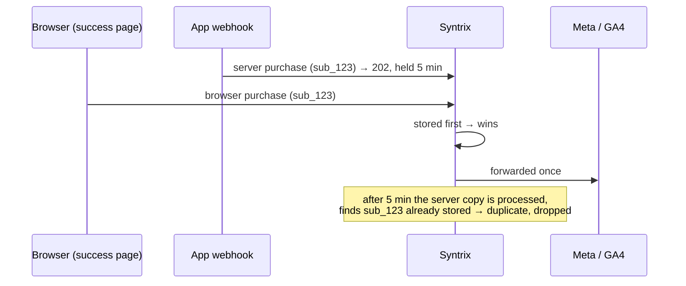

# 2. Tracking (Syntrix pixel)

Syntrix is our ad-conversion tracker. The browser tracker and a server relay
send a small set of events. Syntrix forwards them to Meta, GA4, TikTok,
Google Ads and Klaviyo. Get it wrong and ads can't be attributed to sales,
so ad spend is wasted.

## Two separate pipelines

Never mix them.

| | Ad conversions (Syntrix) | Product analytics (app's own) |
| --- | --- | --- |
| Goes to | Meta, GA4, TikTok, Google Ads, Klaviyo, via Syntrix | The app's own database only |
| May carry | email, transaction id, value, currency, Stripe customer id, country, step number, recovery fields | step numbers, question ids, answer positions, plan, goals |
| Purpose | Tell ad platforms which ads made money | Understand and improve the product |

Product analytics is never forwarded to Syntrix (EV-16). It fires after the
action is saved, and stores ids and positions, never answer text.

## What Syntrix does, and what the app must do

| Syntrix does by itself (**don't build these**) | The app must do (**Syntrix doesn't**) |
| --- | --- |
| Captures ad click ids (fbclid, gclid, ttclid…), UTMs, referrer | Define the `stxq` stub before the script (EV-12) |
| Visitor cookie and browser id | Fire `session_start`. It is **not** automatic (EV-01) |
| `page_view` on load and on client-side navigation | Handle consent: don't load the tracker for a visitor who refused (EV-15) |
| Hashes email per destination | Fire the funnel, lead, checkout and purchase events |
| Dedups `purchase` by `transaction_id` | Send the server `purchase` from the webhook |
| Fires the browser pixels configured in the dashboard | Guard against firing an event twice |

Building click-id, UTM or `_fbc`/`_fbp` capture yourself is a violation
(EV-13). Pre-hashing email breaks matching, because Syntrix hashes it again
(EV-14).

## Hosts and keys

| What | Value |
| --- | --- |
| Production host (tracker **and** API) | `https://tracker.trysyntrix.app` |
| Wrong hosts | `api.syntrix.com` doesn't exist. Nothing lives under `/api/v1` |
| Public key | 32 hex chars. Used by the browser (`data-api-key`) **and** the server relay (`X-API-Key`), the same key |
| Store secret | 64 hex chars. Most apps never need it. Never in a browser or mobile app |

Confirm the host on the store's **Sources** page in the Syntrix dashboard
(SX-01). Keep the relay's copy of the public key in server env and never log
it (SX-02). If the framework inlines the browser key at build time, a
production build must fail when it's missing (SX-03).

## Installing the tracker

```html
<script>window.stxq=window.stxq||function(){(window.stxq.q=window.stxq.q||[]).push(arguments)};</script>
<script async src="https://tracker.trysyntrix.app/lib/stxq.min.js" data-api-key="<public key>"></script>
```

- **The first line, the stub, is required.** Without it, any `stxq(…)` call
  made before the script loads throws an error and the event is lost.
  Syntrix's own guide leaves it out.
- Only `/lib/stxq.min.js` exists. `/lib/stxq.js` returns 404. Never use the
  legacy `/tracker.js`.
- Debug: add `data-debug="true"`, or run `stxq('debug')` in the console.

### Where the tracker may load (EV-02, EV-11)

- **Yes:** landing, offer, paywall (once prices show), success, legal and
  recovery pages.
- **Funnel:** only if its URLs are neutral (see
  [Overview](01-overview.md#neutral-vs-revealing-urls)).
- **Never:** the logged-in app, or any revealing URL.
- Moving into or out of a tracked area must be a **full page load**. The
  tracker reports client-side navigations, so an SPA route change would carry
  it into pages it must not see.
- Keep an explicit list of tracked routes, and warn in development when the
  tracker is live anywhere else.

## Event flows

Fire each event at exactly this moment, with exactly this data, at most once
per the window shown.

### Flow A: landing → funnel → paywall → hosted checkout

| # | Moment | Event | Data | Once per |
| --- | --- | --- | --- | --- |
| 1 | Lands on any tracked page | `session_start` (custom) | none | Browser session |
| 2 | First funnel screen shown | `funnel_started` (custom) | none | Funnel session |
| 3 | Each funnel step completed | `funnel_step_completed` (custom) | `step` | Step per funnel session |
| 4 | Email submitted in the funnel | `generate_lead` | `email` | Funnel session |
| 5 | Last funnel step completed | `funnel_completed` (custom) | none | Funnel session |
| 6 | Paywall shows **prices** | `begin_checkout` | `email`, `checkoutUrl` | Funnel session |
| 7 | Success page loads | `purchase` (browser) | `transaction_id`, `value`, `currency`, `email` | Transaction id, ever |
| 8 | Stripe confirms to server | `purchase` (server) | + `externalId`, `country` | Transaction id, ever |

- Steps 2–5 only when funnel URLs are neutral. If they're revealing, the
  tracker stays out of the funnel, steps 2, 3 and 5 are skipped, and
  `generate_lead` fires at step 6 together with `begin_checkout`.
- If the funnel ends without prices (for example a referral outcome), steps
  6–8 don't happen.

### Flow B: offer page with checkout built in

| # | Moment | Event | Data | Once per |
| --- | --- | --- | --- | --- |
| 1 | Lands | `session_start` | none | Browser session |
| 2 | Email **submitted** in the checkout form, before the payment request | `begin_checkout` | `email`, `checkoutUrl` | Browser session |
| 3 | Payment confirms on the page | `purchase` (browser) | `transaction_id`, `value`, `currency`, `email` | Transaction id, ever |
| 4 | Stripe confirms to server | `purchase` (server) | as Flow A step 8 | Transaction id, ever |

No `generate_lead`. A funnel run after payment fires no more Syntrix events
and never fires `purchase` again.

### Flow C: Apple Pay / Google Pay

| # | Moment | Event | Data | Once per |
| --- | --- | --- | --- | --- |
| 1 | Wallet sheet opens | `begin_checkout` | `email` if known, `checkoutUrl` | Browser session (shared with card form) |
| 2 | Sheet returns paid | `purchase` (browser) | `transaction_id`, `value`, `currency`, `email` from the sheet | Transaction id, ever |
| 3 | Stripe confirms to server | `purchase` (server) | as Flow A step 8 | Transaction id, ever |

### Flow D: abandoned-checkout recovery link

| # | Moment | Event | Data |
| --- | --- | --- | --- |
| 1 | Recovery link reopens the paywall | `cart_recovery_opened` | `email`, `recovery_source`, `recovery_campaign_id` |
| 2 | Paywall shows prices | `begin_recovery_checkout`, **instead of** `begin_checkout` | `email`, `checkoutUrl` |
| 3 | Payment | `purchase`, browser and server | as Flow A |

Remove the recovery token from the URL before the tracker loads (EV-07).

### Firing rules

- **Every place a payment can complete** fires the browser `purchase`:
  success page, in-page card confirm, wallet sheet. Missing one loses those
  sales' attribution (EV-05).
- **Guard before firing:** a per-session guard for session and funnel events,
  a permanent guard keyed on the transaction id for `purchase`. Set the guard
  first, then fire.
- **Only `purchase` has a server copy** (EV-08). Every server event is held
  5 minutes, so a server copy of anything else just arrives late.
- **Tracking can never break a payment** or the page after it. Wrap every
  call (EV-10).
- Use canonical snake_case names. The browser turns `lead` into
  `generate_lead`, but the server doesn't.

## Allowed data

| Field | Format | Events | Rule |
| --- | --- | --- | --- |
| `email` | plaintext, lower-case | `generate_lead`, `begin_checkout`, every `purchase` | Never hashed. Required on every browser `purchase` |
| `transaction_id` | Stripe **subscription** id | `purchase` | Identical on browser and server copies. Never the order id or checkout session id |
| `value` | number, major units | `purchase` | Amount **charged today**: 0 for a free trial, the intro price for intro offers |
| `currency` | ISO-4217, upper-case | `purchase` | Same as the charge |
| `checkoutUrl` | link back to checkout | `begin_checkout`, `begin_recovery_checkout` | Expiring, no personal or sensitive data |
| `externalId` | Stripe customer id | server `purchase` | |
| `country` | ISO-3166 alpha-2 | server `purchase` | Market charged |
| `step` | integer, 1-based | `funnel_step_completed` | Position only |
| `recovery_source`, `recovery_campaign_id` | text | `cart_recovery_opened` | |

**Never send:** plan names, product names, `items` or `content_ids`, real page
URLs, goals, answers, categories, question ids (EV-09).

**Where fields go:**

- **Browser:** everything goes in the data object:
  `stxq('track', 'purchase', { transaction_id, value, currency, email })`.
- **Server:** `email`, `externalId`, `country` and the buyer's `ipAddress` go
  in `userData`. The rest go in `eventData`.

Build each payload in one function, from named fields only, and cover it
with a test.

## The server purchase

Sent from the Stripe fulfilment handler for **every** checkout path, after
its event-id dedup, so a redelivered event never sends it twice (EV-06).

```
POST https://tracker.trysyntrix.app/track/s2s
X-API-Key: <store public key>
Content-Type: application/json

{
  "eventType": "purchase",
  "eventData": { "transaction_id": "sub_…", "value": 29.99, "currency": "USD" },
  "userData":  { "email": "buyer@example.com", "externalId": "cus_…",
                 "country": "US", "ipAddress": "<buyer IP from Stripe metadata>" },
  "sourceUrl": "https://example.com/checkout"
}
```

- `ipAddress` is the **buyer's**, from Stripe metadata. Never the webhook
  request's own IP.
- `sourceUrl` is a fixed, neutral constant, never a real page.
- Don't send `eventId`. Syntrix ignores it on this path.
- Check consent first, if the app records it.

### Responses (SX-04)

| Status | Meaning | Relay does |
| --- | --- | --- |
| **202** `queued: true` | Accepted, held 5 min | Done |
| 401 | Missing or wrong key | Don't retry. Fix the config |
| 404 | URL contains `/api/v1` | Don't retry. Fix the URL |
| 400 | No `eventType` | Don't retry |
| 429 | Rate limited (10,000 / 60 s per key) | Retry |
| 500, network error | Server error, or malformed JSON | Retry |

The relay retries 5xx, 429 and network errors a few times within a total
time budget. It never retries 4xx, never throws into the webhook, records
failures, and is fully off when its key is unset.

## Hold and dedup: why one purchase isn't counted twice



- **Every** server event waits about 5 minutes before processing.
- For `purchase`, **whichever copy is stored first wins.** The browser copy
  wins only if it arrives inside that hold.
- If the visitor closed the tab, there is no browser copy. The server copy
  is then the one forwarded. That's what it's for.
- Both copies must carry a **byte-identical** `transaction_id`, the Stripe
  subscription id. Different ids (e.g. a session id on one side) mean double
  purchases at Meta.

## Consent (EV-15)

Syntrix has **no consent API**. A recorded refusal must mean:

- the app doesn't render the tracker script, **and**
- the relay doesn't send the server purchase for that buyer.

The tracker fires every configured browser pixel (Meta, TikTok…) on each
event, so consent can only be handled by not loading it.

## Where Syntrix's own guide is wrong

Don't copy snippets from Syntrix's `SYNTRIX-INTEGRATION.md`. The code does
this instead:

| Guide says | Reality |
| --- | --- |
| Host `api.syntrix.com`, S2S at `/api/v1/track/s2s` | `tracker.trysyntrix.app`, `/track/s2s` |
| Only server `purchase`/`begin_checkout` are held | Every server event is held 5 min |
| Browser copy always wins | First stored wins |
| Set a matching `eventId` on both sides | Server `eventId` is ignored. Dedup is by `transaction_id` |
| Snippet with no stub | Early calls throw without the stub |
| Debug mode in API-key settings | Only `data-debug`, or `stxq('debug')` |
| Browser PII goes "in `userData`" | Browser: inside the event data. Only the server uses `userData` |

## Requirements

| ID | Requirement | Severity |
| --- | --- | --- |
| EV-01 | `session_start` fires once per browser session on every tracked page | High |
| EV-02 | Funnel events fire only when funnel URLs are neutral; otherwise the tracker is absent from the funnel | Critical if the tracker runs on revealing URLs |
| EV-03 | `generate_lead` fires at the Flow A moment, browser only, with `email` | High |
| EV-04 | `begin_checkout` fires at each flow's moment, browser only, once per session, with `email` and `checkoutUrl` | High |
| EV-05 | Browser `purchase` fires everywhere a payment can complete, once per transaction id ever, with the subscription id, value charged today, currency and email | Critical |
| EV-06 | Server `purchase` is sent from the webhook for every checkout path, with the same id, value and currency as the browser copy | Critical |
| EV-07 | Recovery events used, and the recovery token removed from the URL before the tracker loads | Medium |
| EV-08 | No event other than `purchase` has a server copy | High |
| EV-09 | Only allowed fields; payload built in one place and covered by a test | Critical |
| EV-10 | A tracking failure never blocks or breaks a payment or the page after it | Critical |
| EV-11 | Tracker never in the logged-in app or on revealing URLs; entering or leaving tracked pages is a full page load | Critical |
| EV-12 | Calls made before the script loads aren't lost (the `stxq` stub) | High |
| EV-13 | No app-built attribution capture | Medium |
| EV-14 | Email sent plaintext, never pre-hashed | High |
| EV-15 | A consent refusal suppresses both browser and server events | Critical (EU) |
| EV-16 | Product analytics is separate, never forwarded to Syntrix, stores ids and positions only | Critical |
| SX-01 | The account's own Syntrix host; relay posts to `<host>/track/s2s` | Critical |
| SX-02 | Browser and relay use the public key; the relay reads it from server env; the secret never reaches a client | Critical |
| SX-03 | Production build fails if the inlined browser key is missing | High |
| SX-04 | Relay: 202 = success, retries 5xx/429/network within a budget, never 4xx, never throws, off when unset | High |

**Skills:** `syntrix-setup` builds and fixes this, `syntrix-debug` finds lost
events, `syntrix-guide` answers questions, `syntrix-reports` drafts dashboard
reports.
