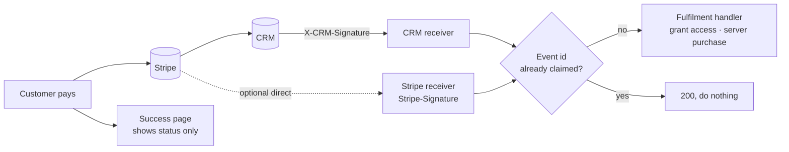

# 3. Payments

Payment code moves money. The rules here make sure people pay what the page
promised, get access exactly once, and never get access without paying.

## The golden rule: access comes only from a verified Stripe event

- Access is granted **only** in the fulfilment handler, after a verified
  Stripe event (PAY-01). Never from the success redirect, a client callback,
  the checkout response, or polling that writes.
- The signature is checked against the **raw** request body before parsing
  (PAY-02). Stripe's `Stripe-Signature` applies on a direct Stripe endpoint;
  `X-CRM-Signature` applies on the CRM relay. See
  [CRM integration](05-crm-integration.md#webhook-receiver).
- **Each event is processed once** (PAY-03), even if it arrives twice, at the
  same moment, or through both the CRM and a direct Stripe endpoint. Claim
  the Stripe event id atomically first (unique insert, `ON CONFLICT DO
  NOTHING`).
- **One fulfilment handler.** If there are two delivery routes, both call the
  same handler with the same dedup. Never two independent fulfilment paths.

### Events the handler must process (PAY-04)

| Stripe event | Typical action |
| --- | --- |
| `checkout.session.completed` | Hosted checkout finished: create or confirm the subscription, grant access |
| `customer.subscription.created` | Record the subscription |
| `customer.subscription.updated` | Status, plan or period changed: update access |
| `customer.subscription.deleted` | Ended: remove access |
| `setup_intent.succeeded` | Free trial card saved: make it the default payment method |

Every checkout path must be handled: hosted, built-in, wallet.

## Checkout order of operations (PAY-05)

Run every rejection check **before** creating anything in Stripe:

1. Existing account? Invalid promo code? Plan not sold in this market?
   Reject now.
2. Mint the app's own `appUserId` and `orderId`, and save a pending order.
3. Only then create the Stripe customer, subscription or intent, with
   [metadata](04-stripe-metadata.md).

This stops orphan Stripe customers and subscriptions for checkouts that were
always going to fail.

## Plan types (PAY-08 – PAY-11)

Every app supports three plan shapes. The server decides what the client
does. The client branches on what the server returns (a payment or a setup),
never on the plan name.

| Shape | Charged today | Client confirms | Trial | Intro discount |
| --- | --- | --- | --- | --- |
| `upfront` | Full price, or intro price | Payment | None | **Allowed** |
| `free-trial` | 0 | Setup (card saved) | Yes, with a length | **Never** |
| `paid-trial` | The trial price | Payment | Yes, with a length | **Never** |

- **Free trial (PAY-09):** the saved card must become the subscription's
  default payment method (e.g. `save_default_payment_method:
  "on_subscription"`). Otherwise the trial ends and nothing is charged. If
  there's no card, the trial cancels. This is Critical: a trial that never
  bills is lost revenue.
- **Intro discounts (PAY-10)** apply to `upfront` plans only. Never stack a
  discount on a trial.
- **Trial length (PAY-11):** a trial plan without a trial length is rejected
  when plans are configured, not at checkout time.
- The `value` sent to Syntrix is always what was **charged today**: 0 for a
  free trial.

## Payment methods and wallets (PAY-06)

- Offer **card, Link, Apple Pay, Google Pay**.
- Wallets use the **merchant's** country, not the visitor's.
- Check availability per wallet. Show only those that work on the device.
- Don't require a billing address.
- Wallet setup errors must never break the card form. Wrap wallet
  initialisation so a failure just hides the wallet button.

## Currency (PAY-07)

Charge in the currency of the price the visitor saw. Turn Stripe's
adaptive / automatic currency conversion **off** explicitly.

## Statement descriptor and names (PAY-12)

Set the statement descriptor explicitly. Product and plan names in Stripe are
**neutral**: they show on bank statements, receipts and in the CRM, so they
must not reveal a condition or goal. Use plan codes like `P2`, not
descriptive names.

## Success page (PAY-13)

- It may arrive before the webhook does. Show a "finishing up" state and wait
  or poll for the status, but **never grant access itself**.
- It fires the browser `purchase` (see [Tracking](02-tracking.md)). If it
  only has a checkout session id, it fetches a receipt from the backend to
  get the subscription id.
- Any unauthenticated receipt lookup returns only transaction id, value,
  currency and email, and only for a recent, paid session.

## Testing

Automated tests:

- [ ] A duplicate webhook delivery is processed once
- [ ] Each plan type creates the right subscription parameters (trial days,
      default payment method, coupon only on upfront)
- [ ] A trial plan without a length is rejected
- [ ] The success path doesn't grant access

Manual, in Stripe **test mode** with the Stripe CLI forwarding webhooks:

- [ ] One purchase per plan type
- [ ] Close the tab before the success page: access is still granted
- [ ] Advance a free-trial test clock to the end: it bills

Never use live keys, live data or real cards.

## Requirements

| ID | Requirement | Severity |
| --- | --- | --- |
| PAY-01 | Access granted only from a verified Stripe event (CRM relay or own Stripe endpoint), never from the success redirect, a client callback or the checkout response | Critical |
| PAY-02 | Webhook verifies the signature against the raw body | Critical |
| PAY-03 | Each Stripe event processed once, even if delivered twice, concurrently, or via both routes | Critical |
| PAY-04 | Handles `checkout.session.completed`, `customer.subscription.created/updated/deleted`, `setup_intent.succeeded` | Critical |
| PAY-05 | No Stripe customer or subscription is created before every rejection check passes | High |
| PAY-06 | Card, Link, Apple Pay, Google Pay; wallet uses the merchant country, checks availability, asks no billing address, can't break the card form | High |
| PAY-07 | Charged in the quoted currency; adaptive conversion off | High |
| PAY-08 | `upfront`, `free-trial`, `paid-trial` supported; the client branches on the server's answer, never the plan name | High |
| PAY-09 | Free trial: the saved card becomes the default payment method; the trial cancels if there's no card | Critical |
| PAY-10 | Intro discounts on `upfront` plans only | Critical |
| PAY-11 | A trial plan with no length is rejected when configured | High |
| PAY-12 | Statement descriptor and product names explicit and neutral | High |
| PAY-13 | Success page handles the gap before the webhook without granting access; receipt lookup is minimal | Medium |

**Skill:** `payment-standard` checks and fixes this. `crm-webhook` builds the
CRM receiver route.
